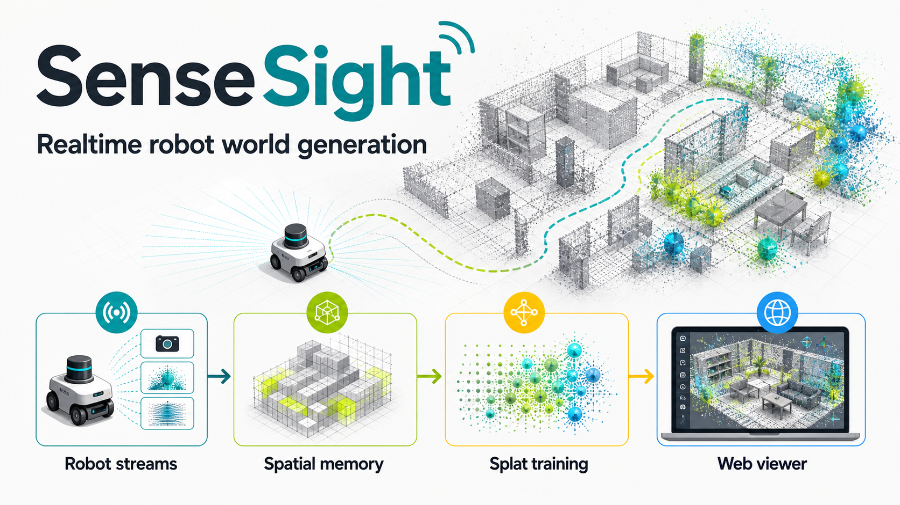
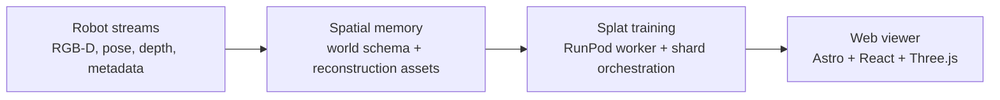

# SenseSight

[](https://github.com/reachjalil/sense-sight/actions/workflows/ci.yml)
[](https://github.com/reachjalil/sense-sight/actions/workflows/deploy-cloudflare-pages.yml)
[](https://github.com/reachjalil/sense-sight/actions/workflows/runpod-worker-image.yml)
[](LICENSE)
[](package.json)
[](package.json)
[](https://github.com/reachjalil/flashpod)

SenseSight is an open-source workspace for realtime robot world generation. It
turns robot sensor streams into explorable 3D spatial memory so a person can
see what the robot sees while the world model is forming.



The public site lives at [sensesight.live](https://sensesight.live). The repo
contains the web viewer, shared world-model contracts, dataset tooling,
Gaussian-splat codecs, and the RunPod training path for turning prepared robot
captures into browser-viewable spatial assets.

## What It Does

- Ingests robot-world inputs such as RGB-D frames, poses, and prepared
  OpenLORIS-style sequences.
- Builds reconstruction-ready world assets: point clouds, COLMAP bundles,
  `.splat` files, metadata manifests, and diagnostics.
- Renders spatial memory in a web viewer with point-cloud and trained
  Gaussian-splat paths.
- Orchestrates GPU training jobs for splat refinement through a typed
  TypeScript/Python RunPod boundary.
- Keeps human review as a trust boundary instead of hiding uncertainty behind
  a generic dashboard.

## How It Works



The product center is spatial understanding: live sensor context becomes a
world model, the world model becomes compact 3D assets, and the browser gives a
human operator a way to inspect what the robot currently knows.

## Workspace Map

- `apps/site` - Astro + React public site and console, deployed to Cloudflare
  Pages.
- `packages/world-schema` - dependency-free world, sensor, pose, and pipeline
  contracts.
- `packages/viewer` - React Three Fiber components for point clouds,
  `.splat`, and trained splat assets.
- `packages/stream-buffers` - allocation-stable buffers for live point-cloud
  and Gaussian streams.
- `packages/splat-codec` - TypeScript reader/writer for the 32-byte `.splat`
  Gaussian format.
- `packages/splat-io` - Python `.splat`/PLY I/O helpers for reconstruction
  tooling.
- `packages/robot-world` - Python robot stream reconstruction and COLMAP
  bundle generation.
- `packages/dataset-tools` - pnpm wrappers around the robot-world dataset
  preparation CLI.
- `packages/runpod-orchestrator` - typed RunPod job client, shard planner,
  state machine, merge, and publish logic.
- `packages/runpod-worker` - CUDA Docker worker that trains/refines Gaussian
  splat shards on RunPod.
- `packages/render-contracts`, `packages/replay-protocol`, and
  `packages/core` - shared contracts for renderer settings, replay streams,
  and app-facing domain events.

## Getting Started

Prerequisites:

- Node.js 22.12 or newer
- pnpm 10 or newer
- Python 3.10 or newer for dataset/reconstruction tooling

Install dependencies:

```bash
pnpm install
```

Run the site locally:

```bash
pnpm dev
```

Prepare or point at a local dataset:

```bash
export SENSESIGHT_DATA_ROOT=~/robot-data/sensesight/openloris-gaussian-splat
pnpm dataset:verify
pnpm dataset:inspect
pnpm dataset:prepare
```

See [docs/data.md](docs/data.md) for the dataset convention and shared local
symlink setup.

## Quality Gates

```bash
pnpm lint
pnpm check
pnpm test
pnpm build
```

CI runs the same quality path on pushes and pull requests. The RunPod worker
image workflow separately builds the CUDA worker image used by GPU training.

## RunPod + flashpod

SenseSight keeps the GPU training path explicit:

- `packages/runpod-worker` owns the Python/CUDA worker image.
- `packages/runpod-orchestrator` owns TypeScript job planning and RunPod REST
  calls.
- [`flashpod`](https://github.com/reachjalil/flashpod) is the companion
  TypeScript-first wrapper for RunPod Flash deployment config and generated
  bridge code.

The current repo keeps the RunPod boundary typed and testable. The Flash
deployment wrapper is intentionally separate so the worker can remain a normal
Docker image while TypeScript owns orchestration and deploy-time configuration.

## Deployment

Deploy the public site:

```bash
pnpm site:deploy
```

The Cloudflare Pages workflow expects `CLOUDFLARE_API_TOKEN` and
`CLOUDFLARE_ACCOUNT_ID` secrets. If they are absent, the workflow still builds
and reports a skipped deploy notice.

The RunPod worker image workflow publishes
`ghcr.io/reachjalil/sense-sight-runpod-worker` from
`packages/runpod-worker`.

## Contributing

Issues and focused pull requests are welcome. Start with
[CONTRIBUTING.md](CONTRIBUTING.md), keep durable architecture decisions in
`docs/`, and run the quality gates before opening a PR.

Security reports should follow [SECURITY.md](SECURITY.md). Project conduct is
covered by [CODE_OF_CONDUCT.md](CODE_OF_CONDUCT.md).

## License

Apache-2.0
